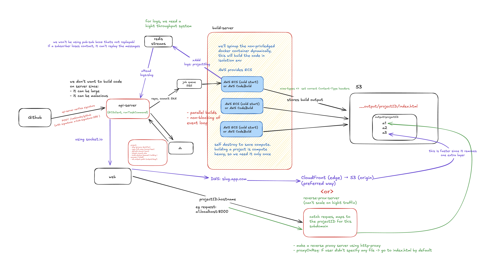

# Vercel Clone

> **Video demo soon...**

## Quick Start

For complete setup instructions, see **[TESTING_GUIDE.md](./TESTING_GUIDE.md)**.

### Ideal Architecture

### Local Setup

1. Run `npm install` in all the 3 services i.e. `api-server`, `build-server` and `s3-reverse-proxy`
2. Docker build the `build-server` and push the image to AWS ECR.
3. Setup the `api-server` by providing all the required config such as TASK ARN and CLUSTER arn.
4. Run `npm run build && npm run start` in `api-server` and `s3-reverse-proxy`

| S.No | Service            | PORT    |
| ---- | ------------------ | ------- |
| 1    | `api-server`       | `:9000` |
| 2    | `socket.io-server` | `:9002` |
| 3    | `s3-reverse-proxy` | `:8000` |

